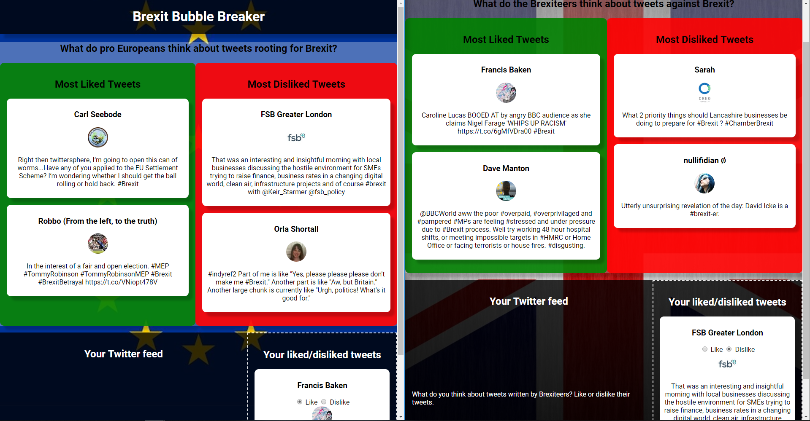
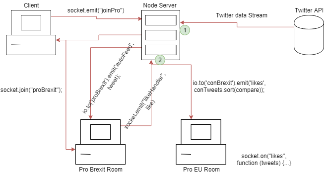

# Real-Time Web @cmda-minor-web · 2018-2019

## Introduction
During this course I will learn how to build a **meaningful** real-time application. I will learn techniques to setup an open connection between the client and the server. This will enable me to send data in real-time both ways, at the same time.

[DEMO](https://chatroomjim.herokuapp.com/)  
To test this it is best to open two windows, select pro brexit in one window and pro europe in the other.  



## Table of Contents

- [Concept](#concept)
- [API](#api)
- [Most Important Screens](#most-important-screens)
- [Data Life Cycle](#data-life-cycle)
- [Sources](#sources)

## Concept
### Brexit Bubble Breaker
My concept is an application wherein you, as a user, get asked if you are pro Brexit or pro-European. Once you select which one you are you get sent to the opposite room. This means pro Brexit users get to see the negative tweets about Brexit in a live feed. Then the user can like or dislike those tweets. Once the tweets are liked they get sent to the pro European users. This way they can see which tweets are liked and disliked. This works for both rooms. The meaning of this app is to get people out of their Brexit bubble, hence the name.

## API
I use the twitter API to get tweets. To get a connection with your server you have to use OAuth. For this I use a node package called [twit](https://www.npmjs.com/package/twit). The data twitter returns is quiet extensive.


<details>
  <summary>Data returned by twitter API</summary>

``` json
{ created_at: 'Wed Mar 13 17:22:28 +0000 2019',
     id: 1105881826676088800,
     id_str: '1105881826676088839',
     text:
      '"Ultimately we are leaving the largest trading bloc and our closest trading partner. We are already seeing impact t… https://t.co/05mDUeeBNd',
     display_text_range: [ 0, 140 ],
     source:
      '<a href="http://twitter.com/download/android" rel="nofollow">Twitter for Android</a>',
     truncated: true,
     in_reply_to_status_id: null,
     in_reply_to_status_id_str: null,
     in_reply_to_user_id: null,
     in_reply_to_user_id_str: null,
     in_reply_to_screen_name: null,
     user:
      { id: 863377035661647900,
        id_str: '863377035661647877',
        name: 'Matty 🇬🇧🇪🇺',
        screen_name: 'Doozy_45',
        location: null,
        url: null,
        description:
         'General News , Politics, Brexit Headlines/News... #AntiBrexit, #ProEU, #Saboteur, #FBPE 🇬🇧🇪🇺',
        translator_type: 'none',
        protected: false,
        verified: false,
        followers_count: 10228,
        friends_count: 9113,
        listed_count: 36,
        favourites_count: 85335,
        statuses_count: 165241,
        created_at: 'Sat May 13 12:55:00 +0000 2017',
        utc_offset: null,
        time_zone: null,
        geo_enabled: false,
        lang: 'en',
        contributors_enabled: false,
        is_translator: false,
        profile_background_color: 'F5F8FA',
        profile_background_image_url: '',
        profile_background_image_url_https: '',
        profile_background_tile: false,
        profile_link_color: '1DA1F2',
        profile_sidebar_border_color: 'C0DEED',
        profile_sidebar_fill_color: 'DDEEF6',
        profile_text_color: '333333',
        profile_use_background_image: true,
        profile_image_url:
         'http://pbs.twimg.com/profile_images/899556584518496256/YoRivQpz_normal.jpg',
        profile_image_url_https:
         'https://pbs.twimg.com/profile_images/899556584518496256/YoRivQpz_normal.jpg',
        profile_banner_url:
         'https://pbs.twimg.com/profile_banners/863377035661647877/1550942062',
        default_profile: true,
        default_profile_image: false,
        following: null,
        follow_request_sent: null,
        notifications: null },
     geo: null,
     coordinates: null,
     place: null,
     contributors: null,
     is_quote_status: false,
     extended_tweet:
      { full_text:
         '"Ultimately we are leaving the largest trading bloc and our closest trading partner. We are already seeing impact to the economy" #Brexit https://t.co/qQPulpx1dx',
        display_text_range: [ 0, 137 ],
        entities:
         { hashtags: [ { text: 'Brexit', indices: [ 130, 137 ] } ],
           urls: [],
           user_mentions: [],
           symbols: [],
           media:
            [ { id: 1105881689501458400,
                id_str: '1105881689501458432',
                indices: [ 138, 161 ],
                additional_media_info: { monetizable: false },
                media_url:
                 'http://pbs.twimg.com/ext_tw_video_thumb/1105881689501458432/pu/img/AhS6DODELWm4KAbz.jpg',
                media_url_https:
                 'https://pbs.twimg.com/ext_tw_video_thumb/1105881689501458432/pu/img/AhS6DODELWm4KAbz.jpg',
                url: 'https://t.co/qQPulpx1dx',
                display_url: 'pic.twitter.com/qQPulpx1dx',
                expanded_url:
                 'https://twitter.com/Doozy_45/status/1105881826676088839/video/1',
                type: 'video',
                video_info:
                 { aspect_ratio: [ 16, 9 ],
                   duration_millis: 40429,
                   variants:
                    [ { bitrate: 2176000,
                        content_type: 'video/mp4',
                        url:
                         'https://video.twimg.com/ext_tw_video/1105881689501458432/pu/vid/1280x720/00MOdjVU2MXwPhcX.mp4?tag=8' },
                      { content_type: 'application/x-mpegURL',
                        url:
                         'https://video.twimg.com/ext_tw_video/1105881689501458432/pu/pl/CULHSn6DjLsaswx6.m3u8?tag=8' },
                      { bitrate: 832000,
                        content_type: 'video/mp4',
                        url:
                         'https://video.twimg.com/ext_tw_video/1105881689501458432/pu/vid/640x360/7o5k3MjVfT6f7NOE.mp4?tag=8' },
                      { bitrate: 256000,
                        content_type: 'video/mp4',
                        url:
                         'https://video.twimg.com/ext_tw_video/1105881689501458432/pu/vid/320x180/JTXOM-yZEDvNkSOd.mp4?tag=8' } ] },
                sizes:
                 { thumb: { w: 150, h: 150, resize: 'crop' },
                   medium: { w: 1200, h: 675, resize: 'fit' },
                   small: { w: 680, h: 383, resize: 'fit' },
                   large: { w: 1280, h: 720, resize: 'fit' } } } ] },
        extended_entities:
         { media:
            [ { id: 1105881689501458400,
                id_str: '1105881689501458432',
                indices: [ 138, 161 ],
                additional_media_info: { monetizable: false },
                media_url:
                 'http://pbs.twimg.com/ext_tw_video_thumb/1105881689501458432/pu/img/AhS6DODELWm4KAbz.jpg',
                media_url_https:
                 'https://pbs.twimg.com/ext_tw_video_thumb/1105881689501458432/pu/img/AhS6DODELWm4KAbz.jpg',
                url: 'https://t.co/qQPulpx1dx',
                display_url: 'pic.twitter.com/qQPulpx1dx',
                expanded_url:
                 'https://twitter.com/Doozy_45/status/1105881826676088839/video/1',
                type: 'video',
                video_info:
                 { aspect_ratio: [ 16, 9 ],
                   duration_millis: 40429,
                   variants:
                    [ { bitrate: 2176000,
                        content_type: 'video/mp4',
                        url:
                         'https://video.twimg.com/ext_tw_video/1105881689501458432/pu/vid/1280x720/00MOdjVU2MXwPhcX.mp4?tag=8' },
                      { content_type: 'application/x-mpegURL',
                        url:
                         'https://video.twimg.com/ext_tw_video/1105881689501458432/pu/pl/CULHSn6DjLsaswx6.m3u8?tag=8' },
                      { bitrate: 832000,
                        content_type: 'video/mp4',
                        url:
                         'https://video.twimg.com/ext_tw_video/1105881689501458432/pu/vid/640x360/7o5k3MjVfT6f7NOE.mp4?tag=8' },
                      { bitrate: 256000,
                        content_type: 'video/mp4',
                        url:
                         'https://video.twimg.com/ext_tw_video/1105881689501458432/pu/vid/320x180/JTXOM-yZEDvNkSOd.mp4?tag=8' } ] },
                sizes:
                 { thumb: { w: 150, h: 150, resize: 'crop' },
                   medium: { w: 1200, h: 675, resize: 'fit' },
                   small: { w: 680, h: 383, resize: 'fit' },
                   large: { w: 1280, h: 720, resize: 'fit' } } } ] } },
     quote_count: 0,
     reply_count: 3,
     retweet_count: 32,
     favorite_count: 53,
     entities:
      { hashtags: [],
        urls:
         [ { url: 'https://t.co/05mDUeeBNd',
             expanded_url: 'https://twitter.com/i/web/status/1105881826676088839',
             display_url: 'twitter.com/i/web/status/1…',
             indices: [ 117, 140 ] } ],
        user_mentions: [],
        symbols: [] },
     favorited: false,
     retweeted: false,
     possibly_sensitive: false,
     filter_level: 'low',
     lang: 'en' },
  is_quote_status: false,
  quote_count: 0,
  reply_count: 0,
  retweet_count: 0,
  favorite_count: 0,
  entities:
   { hashtags: [],
     urls: [],
     user_mentions:
      [ { screen_name: 'Doozy_45',
          name: 'Matty 🇬🇧🇪🇺',
          id: 863377035661647900,
          id_str: '863377035661647877',
          indices: [ 3, 12 ] } ],
     symbols: [] },
  favorited: false,
  retweeted: false,
  filter_level: 'low',
  lang: 'en',
  timestamp_ms: '1555593152035' }
```
</details>

## Data Life Cycle
This is my data life cycle. My server manipulates the data to look like this:
<details>
  <summary>Data as manipulated by the server</summary>
  
```js
  let tweet = { 
  twid: 1121692332162789400,
    active: false,
    author: 'Julian Shea',
    avatar:
     'http://pbs.twimg.com/profile_images/2391879414/me_normal.jpg',
    body:
     "'#grayling.... In my office NOW'. They were going to make a #titanic success of #brexit, don't forget #BrexitChaos #brexitshambles \nhttps://t.co/cgt6SzCJil",
    date: 'Fri Apr 26 08:27:46 +0000 2019',
    screenname: 'juliansheasport',
    sentiment:
     { score: 3,
       comparative: 0.14285714285714285,
       tokens:
        [ "'grayling",
          'in',
          'my',
          'office',
          "now'",
          'they',
          'were',
          'going',
          'to',
          'make',
          'a',
          'titanic',
          'success',
          'of',
          'brexit',
          "don't",
          'forget',
          'brexitchaos',
          'brexitshambles',
          '',
          'httpstcocgt6szcjil' ],
       words: [ 'forget', 'success' ],
       positive: [ 'forget', 'success' ],
       negative: [] },
    likes: 0 };
```
</details>



The data gets changed at the two green circles.
1. The data gets changed by the server as it comes in from the API see above
2. The user gives likes or dislikes and this changes the value of likes

## Sources
Underneath you will find all the sources that were previously mentioned throughout the document and some others which were helpful.

> * [sentiment](https://www.npmjs.com/package/sentiment)
> * [socket.io](https://www.npmjs.com/package/socket.io)
> * [twit](https://www.npmjs.com/package/twit)
