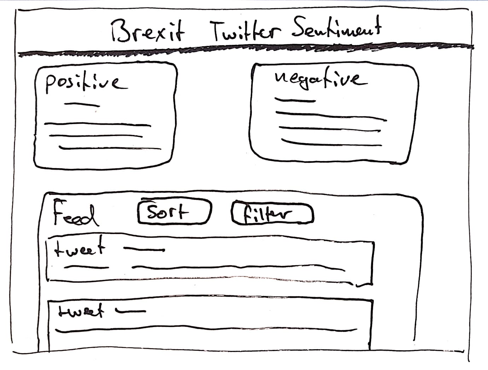

# Real-Time Web @cmda-minor-web · 2018-2019

## Introduction
During this course I will learn how to build a **meaningful** real-time application. I will learn techniques to setup an open connection between the client and the server. This will enable me to send data in real-time both ways, at the same time.


## Table of Contents

- [Concept](#concept)
- [API](#api)
- [Most Important Screens](#most-important-screens)
- [Data Life Cycle](#data-life-cycle)
- [Feedback](#feedback)

## Concept
My concept is an application wherin you, as a user, can see the most positive as well as the most negative tweets about the brexit. It will also show a feed of all the tweets that were sent. The user should be able to filter and sort the feed. All the tweets are gathered in an open stream and will be updated realtime via socket.io.  

## API
I use the twitter API to get tweets. To get a connection with your server you have to use OAuth. For this I use a node package called [twit](https://www.npmjs.com/package/twit). The data twitter returns is quiet extensive.


<details>
  <summary>Data returned by twitter API</summary>

``` json
{ created_at: 'Wed Mar 13 17:22:28 +0000 2019',
     id: 1105881826676088800,
     id_str: '1105881826676088839',
     text:
      '"Ultimately we are leaving the largest trading bloc and our closest trading partner. We are already seeing impact t… https://t.co/05mDUeeBNd',
     display_text_range: [ 0, 140 ],
     source:
      '<a href="http://twitter.com/download/android" rel="nofollow">Twitter for Android</a>',
     truncated: true,
     in_reply_to_status_id: null,
     in_reply_to_status_id_str: null,
     in_reply_to_user_id: null,
     in_reply_to_user_id_str: null,
     in_reply_to_screen_name: null,
     user:
      { id: 863377035661647900,
        id_str: '863377035661647877',
        name: 'Matty 🇬🇧🇪🇺',
        screen_name: 'Doozy_45',
        location: null,
        url: null,
        description:
         'General News , Politics, Brexit Headlines/News... #AntiBrexit, #ProEU, #Saboteur, #FBPE 🇬🇧🇪🇺',
        translator_type: 'none',
        protected: false,
        verified: false,
        followers_count: 10228,
        friends_count: 9113,
        listed_count: 36,
        favourites_count: 85335,
        statuses_count: 165241,
        created_at: 'Sat May 13 12:55:00 +0000 2017',
        utc_offset: null,
        time_zone: null,
        geo_enabled: false,
        lang: 'en',
        contributors_enabled: false,
        is_translator: false,
        profile_background_color: 'F5F8FA',
        profile_background_image_url: '',
        profile_background_image_url_https: '',
        profile_background_tile: false,
        profile_link_color: '1DA1F2',
        profile_sidebar_border_color: 'C0DEED',
        profile_sidebar_fill_color: 'DDEEF6',
        profile_text_color: '333333',
        profile_use_background_image: true,
        profile_image_url:
         'http://pbs.twimg.com/profile_images/899556584518496256/YoRivQpz_normal.jpg',
        profile_image_url_https:
         'https://pbs.twimg.com/profile_images/899556584518496256/YoRivQpz_normal.jpg',
        profile_banner_url:
         'https://pbs.twimg.com/profile_banners/863377035661647877/1550942062',
        default_profile: true,
        default_profile_image: false,
        following: null,
        follow_request_sent: null,
        notifications: null },
     geo: null,
     coordinates: null,
     place: null,
     contributors: null,
     is_quote_status: false,
     extended_tweet:
      { full_text:
         '"Ultimately we are leaving the largest trading bloc and our closest trading partner. We are already seeing impact to the economy" #Brexit https://t.co/qQPulpx1dx',
        display_text_range: [ 0, 137 ],
        entities:
         { hashtags: [ { text: 'Brexit', indices: [ 130, 137 ] } ],
           urls: [],
           user_mentions: [],
           symbols: [],
           media:
            [ { id: 1105881689501458400,
                id_str: '1105881689501458432',
                indices: [ 138, 161 ],
                additional_media_info: { monetizable: false },
                media_url:
                 'http://pbs.twimg.com/ext_tw_video_thumb/1105881689501458432/pu/img/AhS6DODELWm4KAbz.jpg',
                media_url_https:
                 'https://pbs.twimg.com/ext_tw_video_thumb/1105881689501458432/pu/img/AhS6DODELWm4KAbz.jpg',
                url: 'https://t.co/qQPulpx1dx',
                display_url: 'pic.twitter.com/qQPulpx1dx',
                expanded_url:
                 'https://twitter.com/Doozy_45/status/1105881826676088839/video/1',
                type: 'video',
                video_info:
                 { aspect_ratio: [ 16, 9 ],
                   duration_millis: 40429,
                   variants:
                    [ { bitrate: 2176000,
                        content_type: 'video/mp4',
                        url:
                         'https://video.twimg.com/ext_tw_video/1105881689501458432/pu/vid/1280x720/00MOdjVU2MXwPhcX.mp4?tag=8' },
                      { content_type: 'application/x-mpegURL',
                        url:
                         'https://video.twimg.com/ext_tw_video/1105881689501458432/pu/pl/CULHSn6DjLsaswx6.m3u8?tag=8' },
                      { bitrate: 832000,
                        content_type: 'video/mp4',
                        url:
                         'https://video.twimg.com/ext_tw_video/1105881689501458432/pu/vid/640x360/7o5k3MjVfT6f7NOE.mp4?tag=8' },
                      { bitrate: 256000,
                        content_type: 'video/mp4',
                        url:
                         'https://video.twimg.com/ext_tw_video/1105881689501458432/pu/vid/320x180/JTXOM-yZEDvNkSOd.mp4?tag=8' } ] },
                sizes:
                 { thumb: { w: 150, h: 150, resize: 'crop' },
                   medium: { w: 1200, h: 675, resize: 'fit' },
                   small: { w: 680, h: 383, resize: 'fit' },
                   large: { w: 1280, h: 720, resize: 'fit' } } } ] },
        extended_entities:
         { media:
            [ { id: 1105881689501458400,
                id_str: '1105881689501458432',
                indices: [ 138, 161 ],
                additional_media_info: { monetizable: false },
                media_url:
                 'http://pbs.twimg.com/ext_tw_video_thumb/1105881689501458432/pu/img/AhS6DODELWm4KAbz.jpg',
                media_url_https:
                 'https://pbs.twimg.com/ext_tw_video_thumb/1105881689501458432/pu/img/AhS6DODELWm4KAbz.jpg',
                url: 'https://t.co/qQPulpx1dx',
                display_url: 'pic.twitter.com/qQPulpx1dx',
                expanded_url:
                 'https://twitter.com/Doozy_45/status/1105881826676088839/video/1',
                type: 'video',
                video_info:
                 { aspect_ratio: [ 16, 9 ],
                   duration_millis: 40429,
                   variants:
                    [ { bitrate: 2176000,
                        content_type: 'video/mp4',
                        url:
                         'https://video.twimg.com/ext_tw_video/1105881689501458432/pu/vid/1280x720/00MOdjVU2MXwPhcX.mp4?tag=8' },
                      { content_type: 'application/x-mpegURL',
                        url:
                         'https://video.twimg.com/ext_tw_video/1105881689501458432/pu/pl/CULHSn6DjLsaswx6.m3u8?tag=8' },
                      { bitrate: 832000,
                        content_type: 'video/mp4',
                        url:
                         'https://video.twimg.com/ext_tw_video/1105881689501458432/pu/vid/640x360/7o5k3MjVfT6f7NOE.mp4?tag=8' },
                      { bitrate: 256000,
                        content_type: 'video/mp4',
                        url:
                         'https://video.twimg.com/ext_tw_video/1105881689501458432/pu/vid/320x180/JTXOM-yZEDvNkSOd.mp4?tag=8' } ] },
                sizes:
                 { thumb: { w: 150, h: 150, resize: 'crop' },
                   medium: { w: 1200, h: 675, resize: 'fit' },
                   small: { w: 680, h: 383, resize: 'fit' },
                   large: { w: 1280, h: 720, resize: 'fit' } } } ] } },
     quote_count: 0,
     reply_count: 3,
     retweet_count: 32,
     favorite_count: 53,
     entities:
      { hashtags: [],
        urls:
         [ { url: 'https://t.co/05mDUeeBNd',
             expanded_url: 'https://twitter.com/i/web/status/1105881826676088839',
             display_url: 'twitter.com/i/web/status/1…',
             indices: [ 117, 140 ] } ],
        user_mentions: [],
        symbols: [] },
     favorited: false,
     retweeted: false,
     possibly_sensitive: false,
     filter_level: 'low',
     lang: 'en' },
  is_quote_status: false,
  quote_count: 0,
  reply_count: 0,
  retweet_count: 0,
  favorite_count: 0,
  entities:
   { hashtags: [],
     urls: [],
     user_mentions:
      [ { screen_name: 'Doozy_45',
          name: 'Matty 🇬🇧🇪🇺',
          id: 863377035661647900,
          id_str: '863377035661647877',
          indices: [ 3, 12 ] } ],
     symbols: [] },
  favorited: false,
  retweeted: false,
  filter_level: 'low',
  lang: 'en',
  timestamp_ms: '1555593152035' }
```
</details>

## Most Important Screens

These are my most important screens. Currently I only the main screen has sketches.

## Data Life Cycle
This is my data life cycle. My server manipulates the data to look like this:

```js
  let tweet = {
            twid: stream.id,
            active: false,
            author: stream.user.name,
            avatar: stream.user.profile_image_url,
            body: stream.text,
            date: stream.created_at,
            screenname: stream.user.screen_name,
            sentiment: sentiment.analyze(stream.text)
        };
```


## Feedback
What I also noticed the website has many third party scripts that use bandwidth to load. Your own html, css and javascript files use caching headers. It would be nice to use the same caching policy for those third party scripts. Be it by caching headers or by adding a service worker that caches those files. This way the repeat visits would be much, much faster. Implementing this may take some effort though, if at all possible.
